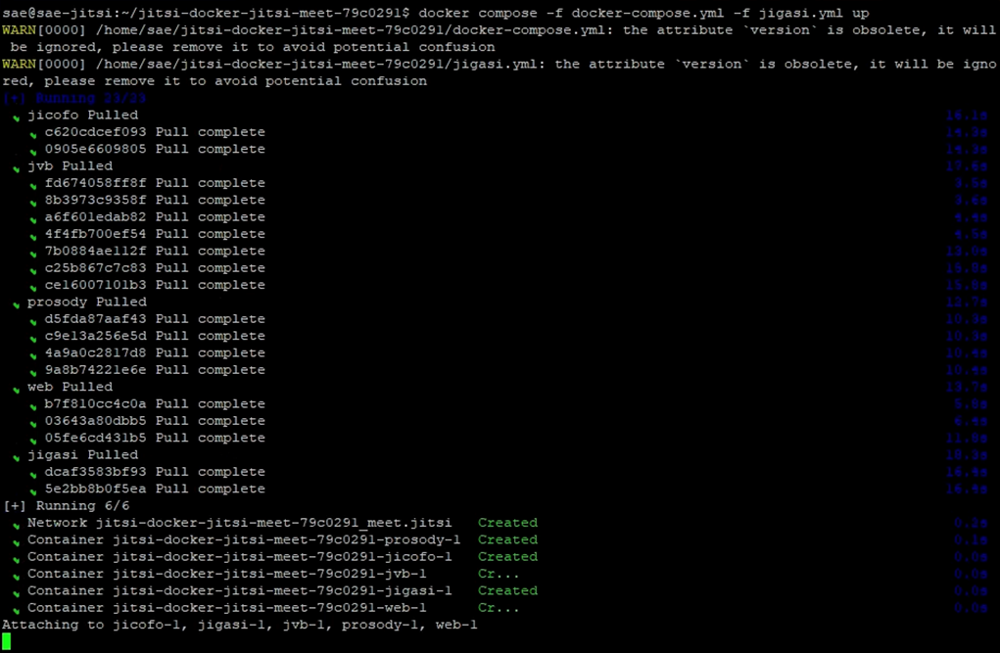
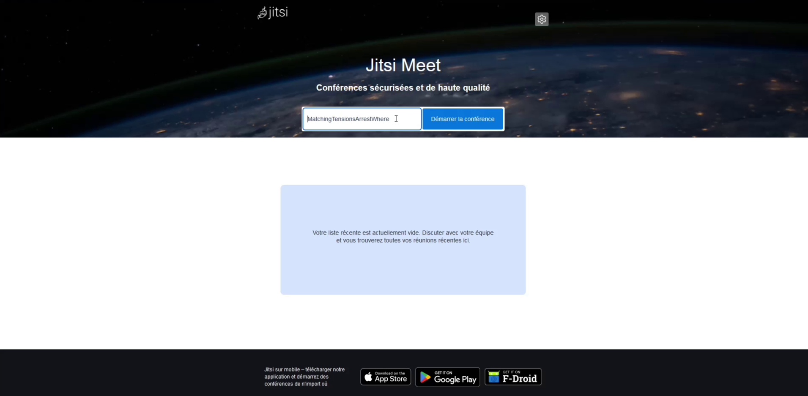
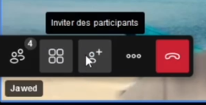
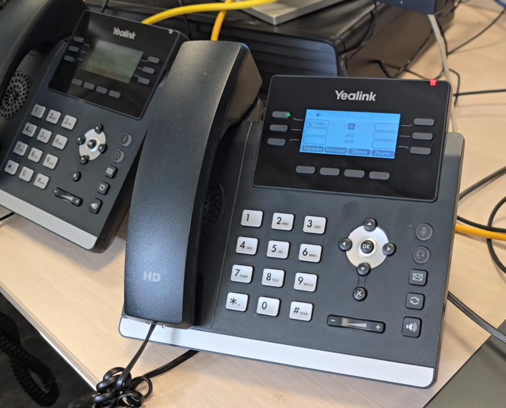

# SAÉ303 – Concevoir un réseau informatique adapté au multimédia

**Rédigé par :** Tristan BRINGUIER et Jack CORRÊA DO CARMO  
**Sujet initial :** Mr. Mohamed Amine Ouamri et Mme. Yamina Amzal  
**Contexte :** Réalisé dans le cadre de la deuxième année de BUT Réseaux et Télécommunications, parcours Réseaux Opérateurs Multimédia à l’IUT de Villetaneuse.

---

## Table des matières

1. [Introduction générale](#introduction-générale)  
2. [Objectif de la SAÉ](#objectif-de-la-saé)  
3. [Pré-requis techniques et mise en place de l’environnement](#pré-requis-techniques-et-mise-en-place-de-lenvironnement)  
   - [I 3.1. Présentation de VMware Workstation Pro](#i-31-présentation-de-vmware-workstation-pro)  
   - [I 3.2. Installation sous Linux (Debian)](#i-32-installation-sous-linux-debian)  
   - [I 3.3. Installation sous Windows](#i-33-installation-sous-windows)  
   - [I 3.4. Configuration du réseau virtuel VMware](#i-34-configuration-du-réseau-virtuel-vmware)  
4. [VoIP / SIP avec FreePBX (Asterisk)](#voip--sip-avec-freepbx-asterisk)  
   - [II 4.1. Rappels sur SIP et la VoIP](#ii-41-rappels-sur-sip-et-la-voip)  
   - [II 4.2. Installation et configuration du serveur FreePBX](#ii-42-installation-et-configuration-du-serveur-freepbx)  
   - [II 4.3. Création des lignes SIP](#ii-43-création-des-lignes-sip)  
   - [II 4.4. Connexion d’un client SIP (Softphone Linphone)](#ii-44-connexion-dun-client-sip-softphone-linphone)  
   - [II 4.5. Connexion d’un téléphone Yealink T42U](#ii-45-connexion-dun-téléphone-yealink-t42u)  
   - [II 4.6. Bonus : Auto-Provisioning des Yealink](#ii-46-bonus--auto-provisioning-des-yealink)  
5. [Jitsi Meet](#jitsi-meet)  
   - [III 5.1. Présentation générale de WebRTC et Jitsi](#iii-51-présentation-générale-de-webrtc-et-jitsi)  
   - [III 5.2. Installation de Jitsi Meet via Docker](#iii-52-installation-de-jitsi-meet-via-docker)  
   - [III 5.3. Visioconférence et intégration SIP avec Jitsi](#iii-53-visioconférence-et-intégration-sip-avec-jitsi)  
6. [Nextcloud Hub](#nextcloud-hub)  
   - [IV 6.1. Contexte et principe de Nextcloud](#iv-61-contexte-et-principe-de-nextcloud)  
   - [IV 6.2. Déploiement de Nextcloud via Docker et WatchTower](#iv-62-déploiement-de-nextcloud-via-docker-et-watchtower)  
   - [IV 6.3. Installation et configuration de Nextcloud](#iv-63-installation-et-configuration-de-nextcloud)  
7. [Conclusion et vérifications](#conclusion-et-vérifications)  
8. [Références et ressources complémentaires](#références-et-ressources-complémentaires)  

---

## Introduction générale

Dans le cadre de cette SAÉ, nous proposons la conception d’un réseau informatique adapté au multimédia, incluant notamment de la téléphonie IP (VoIP), de la visioconférence (WebRTC) et une plateforme collaborative. Les technologies abordées (Asterisk / FreePBX, Jitsi Meet, Nextcloud, etc.) couvrent un large spectre du domaine des réseaux et télécommunications modernes.

---

## Objectif de la SAÉ

L’objectif de cette SAÉ est de mettre en place :

1. Un **service de téléphonie IP** reposant sur Asterisk, administré via FreePBX, et intégrant des téléphones physiques (Yealink) et virtuels (softphones).  
2. Un **service de visioconférence** basé sur Jitsi Meet (protocole WebRTC), permettant d’inviter en conférence des utilisateurs SIP et d’effectuer des ponts téléphoniques depuis un navigateur web.  
3. Une **plateforme collaborative** (Nextcloud) offrant des fonctionnalités de partage de fichiers, agenda, messagerie, édition collaborative, etc.  

Les notions techniques couvertes incluent :

- Les protocoles VoIP : **SIP** (Session Initiation Protocol) pour la signalisation, et **RTP** (Real-time Transport Protocol) pour le transport média.  
- Les technologies de virtualisation, avec **VMware Workstation** pour héberger nos serveurs et clients.  
- Les principes de conteneurisation via **Docker**, pour Jitsi et Nextcloud.  
- L’administration réseau : **DHCP**, **TFTP** pour l’auto-provisioning, configuration IP statique, etc.  
- Les enjeux de **QoS**, de firewalling (Sangoma Smart Firewall), et de sécurisation (Fail2Ban).  

---

## Pré-requis techniques et mise en place de l’environnement

Avant de déployer nos serveurs multimédia, il est impératif de configurer correctement notre environnement de virtualisation. Dans ce projet, **VMware Workstation Pro** sert de base pour héberger les différentes machines virtuelles (VM).

### I 3.1. Présentation de VMware Workstation Pro

VMware Workstation Pro est un hyperviseur de type 2, permettant d’exécuter un ou plusieurs systèmes d’exploitation invités (Guest) sur un même hôte (Host). À la différence des hyperviseurs de type 1 (tels que VMware ESXi), Workstation Pro s’installe sur un système hôte (Windows, Linux, etc.) et s’intègre fortement au poste de travail.

**Avantages :**

- Gestion simple des ressources (CPU, RAM, réseau, stockage).
- Mode NAT et mode Bridge facilitant la mise en réseau des machines virtuelles.
- Redimensionnement automatique et compatibilité avec de nombreuses distributions Linux.

### I 3.2. Installation sous Linux (Debian)

> [!IMPORTANT]  
> Pour Debian, certaines dépendances (build-essential, linux-headers, etc.) doivent être installées avant.

1. **Installer les paquets requis** :  
   ```shell
   sudo apt update
   sudo apt install build-essential linux-headers-$(uname -r) -y
   ```
2. **Télécharger la dernière version de VMware Workstation Pro** depuis le [CDN de VMware](https://softwareupdate.vmware.com/cds/vmw-desktop/ws/), puis extraire l’archive `.tar` :
   *(sélectionner la dernière version disponible, puis linux, puis core, et télécharger l’archive .tar)*
   
   ```shell
   tar --extract -f VMware-Workstation-17.6.3-24583834.x86_64.bundle.tar
   ```
3. **Lancer l’installateur** :  
   
   ```shell
   chmod +x VMware-Workstation-17.6.3-24583834.x86_64.bundle
   sudo ./VMware-Workstation-17.6.3-24583834.x86_64.bundle
   ```
4. **Exécuter VMware** :  
   ```shell
   vmware
   ```


5. **Redémarrer** la machine hôte Linux pour finaliser l’installation :  
   ```shell
   sudo reboot
   ```

Une fois l’installation terminée, VMware Workstation Pro est opérationnel !

### I 3.3. Installation sous Windows

1. **Télécharger la dernière version** de VMware Workstation Pro depuis le [CDN de VMware](https://softwareupdate.vmware.com/cds/vmw-desktop/ws/).
   *(sélectionner la dernière version disponible, puis windows, puis core, et télécharger l’archive .tar)*
2. **Extraire** l’archive `.tar` puis **lancer** l’installateur `.exe`.

Une fois l’installation terminée, VMware Workstation Pro est opérationnel !

### I 3.4. Configuration du réseau virtuel VMware

Pour interconnecter nos serveurs virtuels et du matériel physique (notamment les téléphones Yealink), nous allons utiliser **deux interfaces réseau** sur chaque machine virtuelle :

- **Interface WAN (NAT)** : Gérée automatiquement par VMware, fournissant un accès permanent à Internet.  
- **Interface LAN (Bridge)** : Reliée à une carte réseau Ethernet physique, permettant l’interaction avec le monde physique (téléphones IP, switch Cisco, etc.).

> [!IMPORTANT]  
> Vérifiez dans le **Virtual Network Editor** que le **vmnet0** (bridgé) pointe vers la bonne interface Ethernet.


**Exemple de configuration sur VMware** :  
- Network Adapter 1 : **NAT**
- Network Adapter 2 : **Bridge** vers la carte Ethernet locale


Sous Debian, ces interfaces apparaissent souvent comme `ens33` (NAT) et `ens34` (Bridge).

---

## VoIP / SIP avec FreePBX (Asterisk)

### II 4.1. Rappels sur SIP et la VoIP

**SIP** (Session Initiation Protocol) est un protocole de signalisation utilisé pour initier, modifier et terminer des sessions multimédias (voix, vidéo, messagerie instantanée, etc.). Il s’appuie souvent sur le **port UDP 5060**. Une session SIP s’articule avec le **protocole RTP** (Real-time Transport Protocol), chargé du transport des flux audio et/ou vidéo.  

**Asterisk** est un serveur de téléphonie IP (IP-PBX) open source maintenu par Digium. **FreePBX** en est la couche d’administration web, facilitant la gestion des extensions, trunks, règles d’appel, etc. 

### II 4.2. Installation et configuration du serveur FreePBX

#### II 4.2.1. Création de la machine virtuelle Debian

1. **Télécharger l’ISO de Debian 12** sur [le site officiel Debian](https://www.debian.org/).  
2. **Créer une nouvelle machine virtuelle** avec :  
   - **4 cœurs de CPU**  
   - **4 Go de RAM**  
   - **32 Go de stockage**  
3. **Associer les deux interfaces réseau** (NAT + Bridge) comme expliqué précédemment.  


1. **Installer Debian**, en sélectionnant :  

   - L’interface NAT (`ens33`) comme interface principale (DHCP).  

   

   - **Ne pas définir de mot de passe root**, l’utilisateur créé sera sudoers.

   

   - **XFCE** comme environnement de bureau.  

   

#### II 4.2.2. Configuration des interfaces réseau Debian

Par défaut, Debian utilise **NetworkManager** et le DHCP pour configurer ses interfaces. Dans ce scénario, nous voulons :  
- `ens33` en DHCP (accès internet via NAT).  
- `ens34` en IP statique (192.168.1.1/24), pour nos équipements LAN.

Éditer le fichier `/etc/network/interfaces` :

```bash
sudo nano /etc/network/interfaces
```

```bash
auto ens33
iface ens33 inet dhcp

auto ens34
iface ens34 inet static
  address 192.168.1.1/24
```

**Redémarrer** la machine pour appliquer la config. Vérifier avec `ip a` et tester la connectivité internet avec `ping 1.1.1.1`.


#### II 4.2.3. Installation de FreePBX

1. **Exécuter** `sudo su -`.  
2. **Télécharger** et **exécuter** le script officiel :

   ```shell
   wget https://github.com/FreePBX/sng_freepbx_Debian_install/raw/master/sng_freepbx_Debian_install.sh -O /tmp/sng_freepbx_Debian_install.sh
   bash /tmp/sng_freepbx_Debian_install.sh
   ```


Le script procède à l’installation d’Asterisk et FreePBX. À l’issue, une adresse IP sera indiquée pour accéder à l’interface d’admin.

#### II 4.2.4. Configuration initiale de FreePBX

1. **Ouvrir un navigateur web** et aller sur `http://192.168.1.1/`.  


2. **Définir** les identifiants administrateur et le nom du serveur.  

3. **Passer l’interface** en **Français**.  

4. **Ignorer** les propositions commerciales.  

5. **Appliquer** la configuration en cliquant sur “Apply Config”.


### II 4.3. Création des lignes SIP

1. Dans l’interface FreePBX, aller dans **Connectivité > Postes**.  


2. **Ajouter un poste SIP [chan_pjsip]**.  


3. **Renseigner** :  
   - **Extension Utilisateur** (numéro SIP).  
   - **Nom affiché** (alias).  
   - **Secret** (mot de passe).  


4. **Soumettre** puis **Appliquer la configuration**.


5. **Faire de même** pour avoir **2 lignes SIP**.

### II 4.4. Connexion d’un client SIP (Softphone Linphone)

**Linphone** est un softphone libre disponible sous Linux.

1. **Créer une seconde machine Debian** pour le softphone, configuration réseau similaire (DHCP sur `ens33`, statique sur `ens34` à 192.168.1.2).  
2. **Installer** Linphone :  
   
   ```shell
   sudo apt update
   sudo apt install linphone -y
   ```
3. Lancer Linphone et **connecter un compte SIP** :  
   - **Nom d’utilisateur** = Extension SIP (ex. 100).  
   - **Nom d’affichage** = Alias.
   - **Domaine SIP** = 192.168.1.1.  
   - **Mot de passe** = Secret.
   - **Transport** = UDP (5060).  
   


**Une fois connecté**, Linphone doit passer en **vert** en **haut à gauche** :


4. **Tester** en appelant `*97` (boîte vocale d’Asterisk).


> [!WARNING]  
> Si un mauvais mot de passe SIP est saisi, **Fail2Ban** peut bannir votre IP. Sur le serveur FreePBX :  
> - Lister les bannissements : `fail2ban-client banned`  
> - Débannir tous : `fail2ban-client unban --all`

### II 4.5. Connexion d’un téléphone Yealink T42U

Les téléphones Yealink s’utilisent souvent en entreprise. Pour les configurer il faut :

1. **Réinitialiser** le téléphone en mode usine (maintenir OK, valider la remise à zéro).  
2. **Configurer statiquement** l’IPv4 dans le menu “3 Settings -> 2 Advanced Settings (password = admin) -> 2 Network -> 1 WAN Port -> 2 Static IPv4 Client”  
   - **Adresse IP** : 192.168.1.3/24  
   - **Passerelle** : 192.168.1.1 (IP du FreePBX)  
3. **Activer la ligne SIP** dans “3 Settings -> 2 Advanced Settings -> 1 Accounts -> 1.”  
   - **Display Name** : Nom de l’appelant
   - **Register Name + User Name** = Numéro SIP  
   - **Password** = Secret SIP  
   - **SIP Server 1** : 192.168.1.1  
4. **Sauvegarder** et **tester** en appelant `*97`. 

### II 4.6. Bonus : Auto-Provisioning des Yealink

Afin de déployer rapidement un parc de téléphones Yealink, on peut automatiser leur configuration via :

1. **DHCP** (fournissant l’IP du serveur TFTP).  
2. **TFTP** (hébergeant les fichiers de config associées aux MAC des téléphones).

> [!NOTE]  
> TFTP (Trivial File Transfer Protocol) utilise le port UDP 69 et ne gère pas nativement l’authentification. D’où l’importance de le restreindre au LAN.

**Sur le serveur FreePBX** :

1. Installer `isc-dhcp-server` :  
   ```shell
   sudo apt update
   sudo apt install isc-dhcp-server -y
   ```
2. Éditer `/etc/default/isc-dhcp-server` pour écouter sur `ens34` :
   ```shell
   INTERFACESv4="ens34"
   ```
3. Éditer `/etc/dhcp/dhcpd.conf` :
   ```shell
   subnet 192.168.1.0 netmask 255.255.255.0 {
       range 192.168.1.10 192.168.1.100;
       option routers 192.168.1.1;
       option tftp-server-name "tftp://192.168.1.1";
   }
   ```
4. Créer le fichier TFTP `<mac-du-telephone>.cfg` dans `/tftpboot/` :

   ```bash
   #!version:1.0.0.1
   account.1.enable = 1
   account.1.label = <Numéro SIP>
   account.1.display_name = <Nom du compte>
   account.1.auth_name = <Numéro SIP>
   account.1.user_name = <Numéro SIP>
   account.1.pasword = <Mot de passe SIP>
   account.1.sip_server.1.address = <IP du FreePBX>
   lang.gui = French
   ```
5. Redémarrer `isc-dhcp-server` et `tftpd-hpa` :

   ```shell
   sudo systemctl restart isc-dhcp-server tftpd-hpa
   ```
6. **Réinitialiser** le Yealink et vérifier qu’il obtient bien son IP via DHCP et télécharge sa configuration via TFTP.
7. **Tester** en appelant le `*97`.

---

## WebRTC avec Jitsi Meet

### III 5.1. Présentation générale de WebRTC et Jitsi

**WebRTC** (Web Real-Time Communication) est un ensemble d’API et de protocoles (notamment **ICE, STUN, TURN**) permettant la communication audio/vidéo directement dans le navigateur web. Il utilise SRTP (RTP chiffré) pour le transport et s’appuie généralement sur un serveur d’**interopérabilité** (Jitsi, par exemple) pour la découverte et la gestion des flux.

**Jitsi** est un ensemble de projets open source pour la visioconférence (Jitsi Meet), la passerelle SIP (Jigasi), et la gestion multipoint (Jicofo).  

### III 5.2. Installation de Jitsi Meet via Docker

Nous allons installer Jitsi Meet **sur la même machine** que FreePBX, grâce à Docker.

#### III 5.2.1. Préparer FreePBX pour l’intégration SIP

1. **Créer un compte SIP** dédié à Jitsi :  
   - Numéro SIP = 1000  
   - Mot de passe = “jitsi”  


#### III 5.2.2. Installer Docker

Sur Debian, saisir :

```shell
sudo curl -sSL https://get.docker.com/ | bash
```

#### III 5.2.3. Déployer Jitsi Meet avec Jigasi

1. **Télécharger** la release stable Jitsi :  
   ```shell
   wget $(curl -s https://api.github.com/repos/jitsi/docker-jitsi-meet/releases/latest | grep 'zip' | cut -d\" -f4)
   unzip stable*
   cd jitsi*
   ```
2. **Copier** le fichier d’environnement et générer des mots de passe :
   ```shell
   cp env.example .env
   ./gen-passwords.sh
   ```
3. **Créer** les dossiers de configuration :
   ```shell
   mkdir -p ~/.jitsi-meet-cfg/{web,transcripts,prosody/config,prosody/prosody-plugins-custom,jicofo,jvb,jigasi,jibri}
   ```
4. **Personnaliser** le fichier `.env` :

   ```shell
   cat <<EOF >> .env
   PUBLIC_URL=https://192.168.1.1:8443
   JVB_ADVERTISE_IPS=192.168.1.1
   JIGASI_SIP_URI=1000@192.168.1.1
   JIGASI_SIP_PASSWORD=jitsi
   JIGASI_SIP_SERVER=192.168.1.1
   JIGASI_SIP_PORT=5060
   JIGASI_SIP_TRANSPORT=UDP
   ENABLE_LETS_ENCRYPT=0
   JVB_DISABLE_STUN=true
   TZ=Europe/Paris
   ENABLE_AUTH=0
   ENABLE_GUESTS=1
   EOF
   ```
5. **Générer les certificats SSL** auto-signés et adapter le `docker-compose.yml` :
   ```shell
   mkdir -p ./config/web/certs
   if [ ! -f "./config/web/certs/cert.crt" ] || [ ! -f "./config/web/certs/cert.key" ]; then
       openssl req -x509 -nodes -days 365 -newkey rsa:2048 \
           -keyout "./config/web/certs/cert.key" \
           -out "./config/web/certs/cert.crt" \
           -subj "/C=FR/ST=Ile-de-France/L=Villetaneuse/O=Universite Sorbonne Paris Nord/OU=IUT de Villetaneuse/CN=SAÉ.iutv.univ-paris13.fr"
   fi
   
   sed -i '/- ${CONFIG}\/web:\/config:Z/ a\
               - .\/config\/web\/certs\/cert.crt:\/config\/keys\/cert.crt:Z\
               - .\/config\/web\/certs\/cert.key:\/config\/keys\/cert.key:Z' docker-compose.yml
   ```
6. **Démarrer** Jitsi Meet et Jigasi :

   ```shell
   docker compose -f docker-compose.yml -f jigasi.yml up -d
   ```
   



Accès à l’application : [https://192.168.1.1:8443](https://192.168.1.1:8443).



### III 5.3. Visioconférence et intégration SIP avec Jitsi

1. **Créer** une salle de conférence et inviter un autre poste via l’URL.  
2. **Ajouter** un numéro SIP (ex. poste 100, 101, etc.).  




3. **Décrocher** le téléphone IP pour rejoindre la conférence WebRTC.



Cette solution illustre l’interconnexion d’un **protocole de visioconférence WebRTC** avec un **serveur SIP** (Asterisk/FreePBX), permettant un pont entre le monde de la téléphonie classique et la visioconférence web.

---

## All-in-One avec Nextcloud Hub

### IV 6.1. Contexte et principe de Nextcloud

**Nextcloud** est une plateforme de collaboration et de stockage de fichiers en ligne auto-hébergée. Elle propose un large éventail de fonctionnalités :  
- Partage et synchronisation de fichiers.  
- Édition collaborative de documents (via OnlyOffice ou Collabora).  
- Messagerie instantanée (Talk), agenda, contacts, etc.  

L’auto-hébergement avec **Docker** permet :  
- Une installation centralisée et modulaire.  
- Des mises à jour simplifiées.  
- Une répartition des ressources plus efficace.

**WatchTower** est un service qui surveille et met automatiquement à jour les conteneurs Docker.

### IV 6.2. Déploiement de Nextcloud via Docker et WatchTower

Nous allons exécuter Nextcloud **sur la même machine** FreePBX/Jitsi. **Il faut être connecté en tant qu’utilisateur root** !

1. **Créer** un dossier `nextcloud` :
   ```shell
   mkdir nextcloud
   cd nextcloud
   ```
2. **Créer** le fichier `compose.yaml` :

   ```yaml
   services:
     # Service n°1 : Application Nextcloud
     nextcloud:
       image: ghcr.io/linuxserver/nextcloud:latest
       container_name: nextcloud
       environment:
         - PUID=1000
         - PGID=1000
         - TZ=Europe/Paris
       volumes:
         - ./nextcloud_config/:/config
         - ./nextcloud_data:/data
       ports:
         - 7443:443
       restart: unless-stopped
   
     # Service n°2 : Base de données MariaDB
     mariadb:
       image: ghcr.io/linuxserver/mariadb:latest
       container_name: mariadb
       environment:
         - PUID=1000
         - PGID=1000
         - TZ=Europe/Paris
         - MYSQL_ROOT_PASSWORD=root
         - MYSQL_DATABASE=nextcloud
         - MYSQL_USER=nextcloud
         - MYSQL_PASSWORD=nextcloud
       volumes:
         - ./mariadb_config/:/config
       restart: unless-stopped
   
     # Service n°3 : WatchTower pour mise à jour automatique
     watchtower:
       container_name: watchtower
       image: containrrr/watchtower
       volumes:
         - '/var/run/docker.sock:/var/run/docker.sock'
       restart: unless-stopped
       environment:
         - WATCHTOWER_CLEANUP=true
         - TZ=Europe/Paris
         - WATCHTOWER_INCLUDE_RESTARTING=true
         - WATCHTOWER_POLL_INTERVAL=3600
         - WATCHTOWER_ROLLING_RESTART=true
   ```
3. **Démarrer** la stack :

   ```shell
   docker compose up -d
   ```
4. **Accéder** à l’interface Nextcloud :  
   [https://192.168.1.1:7443](https://192.168.1.1:7443)

### IV 6.3. Installation et configuration de Nextcloud


1. **Créer le compte administrateur** Nextcloud.  
2. **Choisir MariaDB** comme base de données :
   - Utilisateur : `nextcloud`  
   - Mot de passe : `nextcloud`  
   - Nom de la base : `nextcloud`  
   - Hôte : `mariadb` (nom du service Docker)  
3. **Valider** l’installation.  
4. Vous pouvez alors **créer des comptes utilisateurs**, tester le module **Talk** (discussion instantanée et appels audio/vidéo internes), l’agenda, etc.


