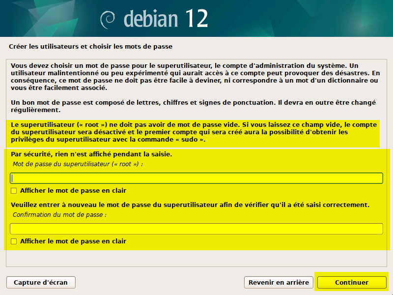

# SAÉ303 - Concevoir un réseau informatique adapté au multimédia

Cette SAÉ a été réalisée dans le cadre de notre deuxième année de BUT Réseaux et Télécommunications, parcours Réseaux Opérateurs Multimédia, au sein de l’IUT de Villetaneuse.

## Introduction

Rédiger une introduction

## Logiciels nécessaires

- **VMWare Workstation Pro** : Pour créer et gérer les machines virtuelles. VMWare est désormais gratuit pour les particuliers et étudiants. Il intègre automatiquement les outils invités permettant le redimensionnement automatique de l'écran et la gestion simplifiée du presse-papier. Les installateurs pour Linux ou Windows sont disponibles sur le [CDN de VMWare](https://softwareupdate.vmware.com/cds/vmw-desktop/ws/).
- **Linphone** : Logiciel utilisé pour passer des appels téléphoniques via le réseau virtuel. Linphone est multiplateforme. Alternativement, **MicroSIP** est une option exclusivement pour Windows.

## Configuration réseau des machines virtuelles

Pour connecter correctement les téléphones physiques Yealink T42U à notre réseau virtuel, il est impératif de configurer soigneusement les interfaces réseau de nos machines virtuelles sous VMWare.

Chaque machine virtuelle doit disposer de deux interfaces réseau :

- Une interface WAN (NAT) gérée automatiquement par VMWare, permettant un accès constant à Internet.
- Une interface LAN (Bridged) reliée directement à un port Ethernet physique de l'ordinateur. Cette dernière interface permet la connexion d'un switch réseau, auquel seront reliés les téléphones physiques.


Configuration dans VMWare :


- Interface réseau **1** : NAT
- Interface réseau **2** : Bridged

Sous Debian, ces interfaces apparaîtront respectivement comme **ens33** et **ens34**.

Pour garantir que l'interface Bridged pointe vers le bon port Ethernet physique, accéder à Virtual Network Editor :


et sélectionner la bonne interface réseau physique dans la configuration Bridged :


## I - Installation et configuration de FreePBX

#### Étape 1 : Création de la machine virtuelle

- Télécharger l’ISO de Debian 12 sur le [site officiel Debian](https://www.debian.org/)
- Créer une nouvelle machine virtuelle sur VMWare avec les caractéristiques suivantes :
  - CPU : 2 cœur
  - Mémoire vive : 2 Go
  - Disque dur : 16 Go


#### Étape 2 : Installation de Debian 12

* Démarrer la machine virtuelle et installer Debian
* Sélectionner **ens33 (NAT)** comme interface principale.


* Attribuer un nom d'hôte clair pour identifier facilement la machine (ex : **sae-freepbx**)


* Ne pas définir de mot de passe root ; créer un utilisateur disposant des permissions **sudo**.



* Sélectionner **XFCE** comme environnement de bureau (plus léger) et activer le **serveur SSH** pour faciliter l'administration à distance.


#### Étape 3 : Configuration des interfaces réseau

Une fois Debian installé, les interfaces réseau ne possèdent pas encore d’adresses IP définies. Pour corriger cela, modifier le fichier de configuration réseau :

```bash
sudo nano /etc/network/interfaces
```

Configurer comme suit :

```bash
auto ens33
iface ens33 inet dhcp

auto ens34
iface ens34 inet static
        address 192.168.1.1/24
```

* Redémarrer la machine virtuelle pour appliquer les changements.
* Vérifier avec la commande `ip a` que les adresses IP sont correctement attribuées.
* Confirmer l'accès à Internet en exécutant un test avec la commande `ping 1.1.1.1`


#### Étape 4 : Installation de FreePBX

L’installation de FreePBX sur Debian s’effectue à l’aide du script officiel disponible sur le [GitHub de FreePBX](https://github.com/FreePBX/sng_freepbx_debian_install).

Dans un terminal, exécuter les commandes suivantes en tant qu'utilisateur :

```
sudo su -
wget https://github.com/FreePBX/sng_freepbx_debian_install/raw/master/sng_freepbx_debian_install.sh -O /tmp/sng_freepbx_debian_install.sh
bash /tmp/sng_freepbx_debian_install.sh
```


Une fois le script exécuté, l’installation de FreePBX démarrera. Il faut donc patienter qu’il termine l’installation de tous les modules.