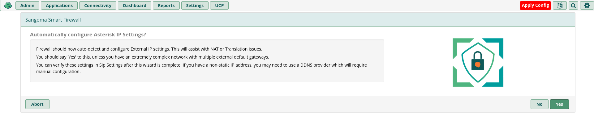

# SAÉ303 - Concevoir un réseau informatique adapté au multimédia

Cette SAÉ a été réalisée dans le cadre de notre deuxième année de BUT Réseaux et Télécommunications, parcours Réseaux Opérateurs Multimédia, au sein de l’IUT de Villetaneuse.

## Introduction

Rédiger une introduction

## 0 - Pré-requis

### Logiciels nécessaires

- **VMWare Workstation Pro** : Pour créer et gérer les machines virtuelles. VMWare est désormais gratuit pour les particuliers et étudiants. Il intègre automatiquement les outils invités permettant le redimensionnement automatique de l'écran et la gestion simplifiée du presse-papier. Les installateurs pour Linux ou Windows sont disponibles sur le [CDN de VMWare](https://softwareupdate.vmware.com/cds/vmw-desktop/ws/).
- **Linphone** : Logiciel utilisé pour passer des appels téléphoniques via le réseau virtuel. Linphone est multiplateforme. Alternativement, **MicroSIP** est une option exclusivement pour Windows.

### Configuration réseau des machines virtuelles

Pour connecter correctement les téléphones physiques Yealink T42U à notre réseau virtuel, il est impératif de configurer soigneusement les interfaces réseau de nos machines virtuelles sous VMWare.

Chaque machine virtuelle doit disposer de deux interfaces réseau :

- Une interface WAN (NAT) gérée automatiquement par VMWare, permettant un accès constant à Internet.
- Une interface LAN (Bridged) reliée directement à un port Ethernet physique de l'ordinateur. Cette dernière interface permet la connexion d'un switch réseau, auquel seront reliés les téléphones physiques.


Configuration dans VMWare :


- Interface réseau **1** : NAT
- Interface réseau **2** : Bridged

Sous Debian, ces interfaces apparaîtront respectivement comme **ens33** et **ens34**.

Pour garantir que l'interface Bridged pointe vers le bon port Ethernet physique, accéder à Virtual Network Editor :


et sélectionner la bonne interface réseau physique dans la configuration Bridged :


## I - FreePBX

#### Étape 1 : Création de la machine virtuelle

- Télécharger l’ISO de Debian 12 sur le [site officiel Debian](https://www.debian.org/)
- Créer une nouvelle machine virtuelle sur VMWare avec les caractéristiques suivantes :
  - CPU : 2 cœur
  - Mémoire vive : 2 Go
  - Disque dur : 16 Go


#### Étape 2 : Installation de Debian 12

* Démarrer la machine virtuelle et installer Debian
* Sélectionner **ens33 (NAT)** comme interface principale


* Attribuer un nom d'hôte clair pour identifier facilement la machine (ex : **sae-freepbx**)


* Ne pas définir de mot de passe root ; créer un utilisateur disposant des permissions **sudo**


* Sélectionner **XFCE** comme environnement de bureau (plus léger) et activer le **serveur SSH** pour faciliter l'administration à distance


#### Étape 3 : Configuration des interfaces réseau


Une fois Debian installé, les interfaces réseau ne possèdent pas encore d’adresses IP définies. Pour corriger cela, modifier le fichier de configuration réseau :

```bash
sudo nano /etc/network/interfaces
```

Configurer comme suit :

```bash
auto ens33
iface ens33 inet dhcp

auto ens34
iface ens34 inet static
        address 192.168.1.1/24
```

* Redémarrer la machine virtuelle pour appliquer les changements.
* Vérifier avec la commande `ip a` que les adresses IP sont correctement attribuées.
* Confirmer l'accès à Internet en exécutant un test avec la commande `ping 1.1.1.1`


#### Étape 4 : Installation de FreePBX

L’installation de FreePBX sur Debian s’effectue à l’aide du script officiel disponible sur le [GitHub de FreePBX](https://github.com/FreePBX/sng_freepbx_debian_install).

Dans un terminal, exécuter les commandes suivantes en tant qu'utilisateur :

```
sudo su -
wget https://github.com/FreePBX/sng_freepbx_debian_install/raw/master/sng_freepbx_debian_install.sh -O /tmp/sng_freepbx_debian_install.sh
bash /tmp/sng_freepbx_debian_install.sh
```

Ce script lance automatiquement l'installation complète de FreePBX avec tous ses modules nécessaires. Cette étape peut prendre du temps, il faut attendre la fin de l'installation sans interruption.


#### Étape 5 : Configuration de FreePBX


* Ouvrir un navigateur web et aller sur http://192.168.1.1/
* Définir un nom d’utilisateur et mot de passe administrateur


* Se connecter sur FreePBX Administration


* Ignorer les offres commerciales


* Définir la langue des messages audios et d’affichage


* Laisser les paramètres par défaut du Sangoma Smart Firewall





* Cliquer, si proposé, sur Appliquer la Configuration. FreePBX est maintenant prêt à l’emploi !


#### Étape 5 : Création des comptes SIP

* Aller dans “Connectivité > Postes”


* Cliquer sur “Ajouter un poste” puis choisir “Ajout nouveau poste SIP”


* Créer un poste SIP : Choisir une extension utilisateur (numéro) et définir le secret (mot de passe)


* Créer un second poste SIP
* Appliquer la configuration


#### Étape 6.1 : Connecter un client SIP Softphone

* Installer une seconde machine Debian avec les mêmes étapes que précédemment (configuration des cartes réseaux)

```
sudo nano /etc/network/interfaces
```

Configurer comme suit :

```
auto ens33
iface ens33 inet dhcp

auto ens34
iface ens34 inet static
        address 192.168.1.10/24
```

* Installer Liphone

```
sudo apt update
sudo apt install linphone -y
```

* Démarrer Linphone


* Aller sur “Utiliser un compte SIP”


* Renseigner les informations du compte SIP créé précédemment


* Une fois Linphone connecté, l’icône devrait passer au vert


* Appeler ```*97``` et vérifier si le son fonctionne


#### Étape 6.2 : Connecter un Yealink T42U

Cette partie est extraite du sujet de TP de Sami Evangelista.

Nous allons redémarrer le téléphone en mode usine pour revenir à une configuration vierge.

* Mettre le téléphone sous tension
* Redémarrer le téléphone en mode usine : laisser le bouton OK appuyé pendant quelques secondes puis confirmer le redémarrage.

Une fois le téléphone redémarré, nous allons d’abord configurer statiquement ses paramètres IP.

* Aller dans le menu “3 Settings” -> “2 Advanced Settings” (le mot de passe est admin) -> “2 Network” -> “1 WAN Port” -> “2 IPv4” -> “2 Static IPv4 Client”
* Définir une IP du réseau 192.168.1.0/24 (ex : 192.168.1.11), et choisir comme passerelle l’IP du FreePBX (192.168.1.1)
* Sauvegarder les paramètres : “Save”

Une fois la configuration IP appliquée, ping le téléphone depuis le serveur FreePBX.
Une fois que les pings passent, configurer la ligne SIP.

* Aller dans le menu “3 Settings” -> “2 Advanced Settings” -> “1 Accounts” -> “1.”
* Passer “Active line” à “Enabled”
* Saisir les paramètres suivants :
  * Display Name : Le nom qui s’affichera quand le correspondant recevra un appel
  * Register Name : Numéro du compte SIP
  * User Name : Numéro du compte SIP
  * Password : Mot de passe du compte SIP
  * SIP Server 1 : IP du FreePBX
* Sauvegarder les paramètres : “Save”

Une fois les paramètres saisis, le Display Name devrait s’afficher sur l’écran du téléphone.

* Vérifier la connectivité en appelant le ```*97```
* Effectuer un appel entre le Yealink et le Softphone

FreePBX est désormais installé et correctement configuré !

#### Étape 7 (Bonus) : Auto-Provisioning des Yealink

Il est nécessaire de configurer manuellement les adresses IP et numéros SIP sur les téléphones Yealink, ce qui peut-être fort contraignant en entreprise quand on a un parc de téléphones énorme à gérer.

Cette partie est extraite du sujet de TP de Sami Evangelista.

- Installer isc-dhcp-server sur le serveur FreePBX

```
sudo apt update
sudo apt install isc-dhcp-server -y
```

- Configurer l’interface d’écoute du serveur DHCP

```
sudo nano /etc/default/isc-dhcp-server
```

```
INTERFACESv4="ens34"
```

- Créer la configuration du serveur DHCP

```
sudo nano /etc/dhcp/dhcpd.conf
```

```
# Définition du sous-réseau 192.168.1.0/24
subnet 192.168.1.0 netmask 255.255.255.0 {
    # Plage d'adresses DHCP
    range 192.168.1.10 192.168.1.100;
    # Passerelle (gateway)
    option routers 192.168.1.1;
    # Masque de sous-réseau
    option subnet-mask 255.255.255.0;
    # Option TFTP (pour le provisionning des tels)
    option tftp-server-name "tftp://192.168.1.1";
}
```

- Récupérer l’adresse MAC d’un téléphone Yealink et créer le fichier de configuration associé

```
sudo nano /tftpboot/addressemacdutelephone.cfg
```

```
#!version:1.0.0.1
account.1.enable = 1
account.1.label = Numéro de téléphone SIP
account.1.display_name = Nom de l'appelant
account.1.auth_name = Numéro de Téléphone SIP
account.1.user_name = Numéro de Téléphone SIP
account.1.pasword = Mot de passe du numéro SIP
account.1.sip_server.1.address = IP du serveur FreePBX
lang.gui = French
```

- Redémarrer le serveur DHCP et le serveur TFTP

```
sudo systemctl restart isc-dhcp-server tftpd-hpa
```

- Redémarrer le téléphone Yealink en mode usine et vérifier si le téléphone récupère le compte SIP

- Vérifier le bon fonctionnement du téléphone en appelant le ```*97```

## II - Jitsi Meet

#### Étape 0 : Préparer FreePBX

- Créer un poste SIP pour Jitsi avec pour numéro 1000


#### Étape 1 : Installer le Docker Engine

```
sudo curl -sSL https://get.docker.com/ | bash
```

#### Étape 2 : Télécharger les fichiers Jitsi

```
wget $(curl -s https://api.github.com/repos/jitsi/docker-jitsi-meet/releases/latest | grep 'zip' | cut -d\" -f4)
unzip stable*
cd jitsi*
cp env.example .env
./gen-passwords.sh
mkdir -p ~/.jitsi-meet-cfg/{web,transcripts,prosody/config,prosody/prosody-plugins-custom,jicofo,jvb,jigasi,jibri}

cat <<EOF >> .env
PUBLIC_URL=https://192.168.1.1:8443
JVB_ADVERTISE_IPS=192.168.1.1
JIGASI_SIP_URI=1000@192.168.1.1
JIGASI_SIP_PASSWORD=jitsi
JIGASI_SIP_SERVER=192.168.1.1
JIGASI_SIP_PORT=5060
JIGASI_SIP_TRANSPORT=UDP
ENABLE_LETS_ENCRYPT=0
JVB_DISABLE_STUN=true
TZ=Europe/Paris
ENABLE_AUTH=0
ENABLE_GUESTS=1
EOF

mkdir -p ./config/web/certs
if [ ! -f "./config/web/certs/cert.crt" ] || [ ! -f "./config/web/certs/cert.key" ]; then
    openssl req -x509 -nodes -days 365 -newkey rsa:2048 \
        -keyout "./config/web/certs/cert.key" \
        -out "./config/web/certs/cert.crt" \
        -subj "/C=FR/ST=Ile-de-France/L=Villetaneuse/O=Universite Sorbonne Paris Nord/OU=IUT de Villetaneuse/CN=sae.iutv.univ-paris13.fr"
fi
sed -i '/- ${CONFIG}\/web:\/config:Z/ a\
            - .\/config\/web\/certs\/cert.crt:\/config\/keys\/cert.crt:Z\
            - .\/config\/web\/certs\/cert.key:\/config\/keys\/cert.key:Z' docker-compose.yml
```


```
docker compose -f docker-compose.yml -f jigasi.yml up -d
```

https://192.168.1.1:8443

#### Étape 3 : Visioconférence + SIP

* Passer un appel entre deux ordinateurs en accédant à https://192.168.1.1:8443/ depuis deux ordinateurs du même réseau local
* Appeler un téléphone SIP via le bouton d’invitation

### III - Nextcloud Hub

#### Étape 1 : Forger le compose.yaml

```
mkdir nextcloud
nano compose.yaml
```

```yaml
services:
  nextcloud:
    image: ghcr.io/linuxserver/nextcloud:latest
    container_name: nextcloud
    environment:
      - PUID=1000
      - PGID=1000
      - TZ=Europe/Paris
    volumes:
      - ./nextcloud_config/:/config
      - ./nextcloud_data:/data
    ports:
      - 7443:443
    restart: unless-stopped
  mariadb:
    image: ghcr.io/linuxserver/mariadb:latest
    container_name: mariadb
    environment:
      - PUID=1000
      - PGID=1000
      - TZ=Europe/Paris
      - MYSQL_ROOT_PASSWORD=root
      - MYSQL_DATABASE=nextcloud
      - MYSQL_USER=nextcloud
      - MYSQL_PASSWORD=nextcloud
    volumes:
      - ./mariadb_config/:/config
    restart: unless-stopped
```

