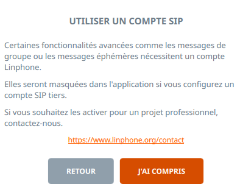

# SAÉ303 - Concevoir un réseau informatique adapté au multimédia


Rédigé par Tristan BRINGUIER et Jack CORRÊA DO CARMO. Cette SAÉ a été réalisée dans le cadre de notre deuxième année de BUT Réseaux et Télécommunications parcours Réseaux Opérateurs Multimédia à l’IUT de Villetaneuse. Le sujet initial de cette SAÉ proviens de nos professeurs Mr. Mohamed Amine Ouamri et Mme. Yamina Amzal.

## Objectif

L’objectif de cette SAÉ est 

## 0 - Pré-requis

> [!IMPORTANT]  
> Pour assurer le bon fonctionnement de cette SAE, il est nécessaire d’installer et configurer des logiciels de manière spécifique.


- **VMWare Workstation Pro** : Pour créer et gérer les machines virtuelles. VMWare est désormais gratuit pour les particuliers et étudiants. Il intègre automatiquement les outils invités permettant le redimensionnement automatique de l'écran et la gestion simplifiée du presse-papier.

### Installer VMWare Workstation Pro sous Linux (Debian)

* Installer les paquets suivants (ce sont des dépendances à VMWare)

```shell
sudo apt update
sudo apt install build-essential linux-headers-$(uname -r) -y
```

* Aller sur [le CDN de VMWare](https://softwareupdate.vmware.com/cds/vmw-desktop/ws/) et sélectionner la dernière version disponible, puis linux, puis core, et télécharger l’archive .tar
* Décompresser l’archive .tar (remplacer le nom du fichier par celui téléchargé)

```shell
tar --extract -f VMware-Workstation-17.6.3-24583834.x86_64.bundle.tar
```

* Exécuter en tant qu’administrateur l’installateur présent dans l’archive

```shell
chmod +x VMware-Workstation-17.6.3-24583834.x86_64.bundle
sudo ./VMware-Workstation-17.6.3-24583834.x86_64.bundle
```

* Démarrer VMWare en ligne de commandes

```shell
vmware
```


* Fermer VMWare et redémarrer le linux pour finaliser l’installation

```shell
sudo reboot
```

> [!NOTE]  
> Après redémarrage du linux, VMWare Workstation est installé et prêt à l’emploi !

### Installer VMWare Workstation Pro sous Windows

* Aller sur [le CDN de VMWare](https://softwareupdate.vmware.com/cds/vmw-desktop/ws/) et sélectionner la dernière version disponible, puis windows, puis core, et télécharger l’archive .tar
* Décompresser l’archive .tar et installer VMWare via l’installateur présent dans l’archive

> [!NOTE]  
> VMWare Workstation est installé et prêt à l’emploi !

### Configurer le réseau virtuel VMWare

Pour interconnecter avec aisance les téléphones physiques Yealink au réseau virtualisé, il est impératif de configurer soigneusement les interfaces réseau des machines virtuelles sous VMWare.

Chaque machine virtuelle doit disposer de deux interfaces réseau :

* Une interface “WAN” (NAT) gérée automatiquement par VMWare. Cette interface permet un accès simple à et constant à Internet
* Une interface “LAN” (Bridgée) reliée à un port Ethernet physique de l’ordinateur. Cette interface permet un accès physique aux équipements branchés en Ethernet à l’ordinateur. (ex : Switch Cisco, Téléphone Yealink, etc.)

#### ILLUSTRATION RÉSEAU GNS3

> [!IMPORTANT]  
> Il est primordial de vérifier que l’interface Bridgée renvoie vers la bonne interface physique !

* Ouvrir le Virtual Network Editor


- Sélectionner vmnet0 (qui a pour type bridged) et choisir la bonne interface Ethernet


Les machines virtuelles devront être connectées de la sorte :


- Network Adapter (Interface réseau 1) : NAT
- Network Adapter 2 (Interface réseau 2) : Bridgée

Sous **Debian**, les interfaces réseaux apparaîtront respectivement comme ens33 et ens34.

## 1 - VoIP / SIP avec FreePBX (Asterisk)

FreePBX fournis une interface d’administration web simple et intuitive, tout en reposant sur la robustesse du moteur de téléphonie Asterisk. FreePBX est né en 2004 sous le nom d’Asterisk Management Portal, dans le but de simplifier l’administration d’Asterisk. Au fil des années, rebaptisé en FreePBX, il est devenu l’une des solutions de référence pour la gestion de la téléphonie IP dans l’écosystème open source.

En plus de reposer sur une large communauté et de proposer de nombreuses fonctionnalités avancées (gestion des extensions, lignes SIP, files d’attente d’appels, conférences, etc.), FreePBX a longtemps été distribué sous forme d’une distribution Linux indépendante basée sur RHEL (Red Hat Enterprise Linux) — une solution plus robuste pour un usage d’entreprise mais plus complexe à installer. Depuis la version 17, FreePBX est désormais porté sur Debian ce qui facilite grandement l’installation et la maintenance.

#### Étape 1 : Création et installation de la machine virtuelle

- Télécharger l’ISO de Debian 12 sur le [site officiel Debian](https://www.debian.org/)
- Créer une nouvelle machine virtuelle sur VMWare avec les caractéristiques suivantes :
  - **CPU : 4 cœurs**
  - **RAM : 4 Go**
  - **Stockage : 32 Go**

* Configurer les interfaces réseau en suivant la procédure dans les pré-requis
* Démarrer la machine virtuelle et installer Debian
* Sélectionner **ens33 (NAT)** comme interface principale

* Ne pas définir de mot de passe root, le compte créé sera membre du groupe sudoers

* Sélectionner **XFCE** comme environnement de bureau (plus léger)


**Debian** est maintenant installé ! Nous allons maintenant configurer les interfaces réseaux.

#### Étape 2 : Configuration des interfaces réseau

La configuration des adresses IP sous Debian repose par défaut en DHCP via NetworkManager. Notre configuration réseau étant particulière, il est nécessaire de configurer manuellement les interfaces de manière permanante grâce au fichier /etc/network/interfaces.

- Modifier le fichier de configuration réseau :

```bash
sudo nano /etc/network/interfaces
```

```bash
auto ens33 # Initialisation de l'interface ens33
iface ens33 inet dhcp # Configuration via DHCP de l'interface ens33

auto ens34 # Initialisation de l'interface ens34
iface ens34 inet static # Configuration de manière statique de l'interface ens34
        address 192.168.1.1/24 # L'interface ens34 aura pour addresse 192.168.1.1 avec pour masque de sous-réseau un /24 (255.255.255.0)
```

* Redémarrer la machine virtuelle pour appliquer les changements
* Vérifier avec la commande `ip a` que les adresses IP sont correctement attribuées (ens33 doit avoir une IP d’un sous réseau obtenu via un DHCP et ens34 avoir l’IP fixe 192.168.1.1/24)
* Confirmer l'accès à Internet en exécutant un ```ping 1.1.1.1```


Le réseau de notre Debian est maintenant parfaitement configuré ! Nous allons maintenant installer FreePBX.

#### Étape 3 : Installation de FreePBX

Nous allons suivre les instructions du guide officiel présent sur le [GitHub de FreePBX](https://github.com/FreePBX/sng_freepbx_debian_install).

- Exécuter les commandes suivantes  :

```shell
sudo su -
wget https://github.com/FreePBX/sng_freepbx_debian_install/raw/master/sng_freepbx_debian_install.sh -O /tmp/sng_freepbx_debian_install.sh
bash /tmp/sng_freepbx_debian_install.sh
```

Le script lance automatiquement l'installation complète de FreePBX avec tous ses modules nécessaires. Cette étape peut prendre du temps, il faut attendre la fin de l'installation sans interruption.


À la fin de son exécution, le script affichera des informations telle que l’adresse IP du FreePBX en vert. Nous allons maintenant le configurer avec l’aide de son interface graphique.

#### Étape 4 : Configuration de FreePBX

* Ouvrir un navigateur web et aller sur http://192.168.1.1/
* Définir le compte utilisateur administrateur de l’instance FreePBX, définir un mail quelconque pour les notifications du système, définir le nom du serveur FreePBX. Puis cliquer sur “Setup System”


* Accéder à l’interface d’administration en allant dans l’onglet “FreePBX Administration”. Se connecter avec les identifiants définis précédemment


* Ignorer toutes les propositions commerciales

* Définir la langue du système sur Français


* Laisser les paramètres par défaut du Sangoma Smart Firewall (dire “Yes” à toutes les propositions)

- Ignorer toutes les propositions commerciales

* Pour finaliser l’installation, cliquer sur “Appliquer la configuration” ou “Apply Config” en haut à droite si proposé


L’instance FreePBX est désormais installée ! Nous allons maintenant déployer des postes SIP pour connecter nos téléphones physiques et virtuels.

#### Étape 5 : Création des comptes SIP

* Aller dans la rubrique “**Connectivité** > **Postes**”


* Cliquer sur “**Ajouter un poste**” puis choisir “**Ajout nouveau poste SIP [chan_pjsip]**”


* Définir toutes les informations nécessaires au bon fonctionnement de la ligne

  * Extension Utilisateur : Le numéro de la ligne SIP
  * Nom affiché : Le nom de l’appelant qui sera visible des destinataires
  * Secret : Le mot de passe du compte SIP qui sera créé pour ce numéro de téléphone

  Il n’est pas nécessaire de modifier les paramètres du gestionnaire d’utilisateur, car celui-ci concerne le service d’annuaire de FreePBX que nous n’utiliserons pas.
  Une fois les informations rentrées, cliquer sur “Soumettre”


* Créer une seconde ligne SIP pour le téléphone Yealink, ou inversement, pour le Softphone
* Après avoir créé les lignes SIP, appliquer la configuration en cliquant sur “Appliquer la configuration”


Les comptes / lignes SIP sont désormais créées, nous allons pouvoir connecter des clients SIP pour passer des appels.

#### Étape 6.1 : Connecter un client SIP Softphone

Nous utiliserons une machine Linux pour sa légèreté avec le client Linphone dessus. Il est également possible sous Windows d’utiliser le client MicroSIP.

* Installer une seconde machine Debian avec la même procédure que pour le serveur FreePBX (faire attention à la configuration des interfaces réseau sur VMWare)

* Configurer les interfaces réseaux

```shell
sudo nano /etc/network/interfaces
```

```shell
auto ens33 # Initialisation de l'interface ens33
iface ens33 inet dhcp # Configuration via DHCP de l'interface ens33

auto ens34 # Initialisation de l'interface ens34
iface ens34 inet static # Configuration de manière statique de l'interface ens34
        address 192.168.1.2/24 # L'interface ens34 aura pour addresse 192.168.1.2 avec pour masque de sous-réseau un /24 (255.255.255.0)
```

* Installer le softphone SIP Liphone

```shell
sudo apt update
sudo apt install linphone -y
```

* Ouvrir Linphone


* Sélectionner “Utiliser un compte SIP” et accepter les conditions d’utilisation





> [!WARNING]  
> Il ne faut pas que Linphone soit installé sur la même machine qu’un serveur Asterisk. Il y a un conflit de ports l’empêchant de fonctionner. Sur les machines de TP il est préférable d’éteindre le service Asterisk si installé : `systemctl stop asterisk`
* Renseigner les informations du compte SIP créé précédemment

  * Nom d’utilisateur : Numéro de ligne SIP
  * Nom d’affichage : Numéro de l’appelant, visible du destinataire
  * Domaine SIP : Adresse IP du serveur FreePBX (192.168.1.1)
  * Transport : UDP (port 5060 par défaut d’Asterisk)

  Puis cliquer sur “Utiliser”


* Si toutes les informations rentrées sont valides, alors Linphone doit ouvrir une session SIP et passer en vert en haut à gauche comme ci-dessous :

> [!WARNING]  
> Si jamais des informations erronées ont été rentrées par erreur, il est possible que le Sangoma Firewall bannisse l’adresse IP du client.
> Pour lister les bannissements, sur le serveur FreePBX : `fail2ban-client banned`
> Pour débannir toutes les adresses IPs, sur le serveur FreePBX : `fail2ban-client unban --all`


* Appeler ```*97``` (le numéro de la boîte vocale) et vérifier si l’appel fonctionne


> [!WARNING]  
> Si jamais l’appel ne passe pas, vérifier les configurations IP des machines, il faut qu’elles soient toutes sur le même réseau local.
> Vérifier également l’état du son sous linux, ou analyser les trames réseau avec Wireshark.

Nous avons maintenant un Softphone SIP connecté à notre FreePBX ! Pour passer un appel entre deux téléphones, nous pouvons utiliser deux Softphone SIP, mais l’IUT mets à disposition des Yealink T42U. Voyons maintenant comment les configurer.

#### Étape 6.2 : Connecter un Yealink T42U

*Cette partie s’appuie grandement sur le [cours](./pdf/R316-ROM-cours.pdf) et [TPs](./pdf/R316-ROM-tp.pdf) de [Sami Evangelista](https://lipn.fr/~evangelista/)*

Les téléphones Yealink sont succeptibles d’avoir été utilisés par un autre groupe, et de ne pas avoir été réinitialisé. Nous commençons donc par redémarrer le téléphone en mode usine pour revenir à une configuration vierge.

* Mettre le téléphone sous tension
* Laisser le bouton OK appuyé pendant quelques secondes puis confirmer le redémarrage.

Une fois le téléphone redémarré, nous allons configurer statiquement ses paramètres IP.

* Aller dans le menu “3 Settings” -> “2 Advanced Settings” (le mot de passe est admin) -> “2 Network” -> “1 WAN Port” -> “2 IPv4” -> “2 Static IPv4 Client”
* Définir une IP du réseau 192.168.1.0/24 (ex : 192.168.1.3), et choisir comme passerelle l’IP du FreePBX (ex : 192.168.1.1)
* Sauvegarder les paramètres en cliquant sur “Save”

Une fois la configuration IP appliquée, vérifier que le téléphone est bien connecté au réseau en effectuant un ping depuis le FreePBX.

Nous allons maintenant configurer la ligne SIP associée au téléphone

* Aller dans le menu “3 Settings” -> “2 Advanced Settings” -> “1 Accounts” -> “1.”
* Passer “Active line” à “Enabled”
* Saisir les paramètres suivants :
  * Display Name : Le nom qui s’affichera quand le destinataire recevra un appel
  * Register Name : Numéro de ligne SIP
  * User Name : Numéro de ligne SIP
  * Password : Mot de passe de la ligne SIP
  * SIP Server 1 : L’IP du serveur FreePBX
* Sauvegarder les paramètres en cliquant sur “Save”

Une fois les paramètres saisis, si l’on reviens sur l’écran d’accueil, le Display Name devrait s’afficher sur l’écran du téléphone.

> [!WARNING]  
> Si jamais des informations erronées ont été rentrées par erreur, il est possible que le Sangoma Firewall bannisse l’adresse IP du téléphone.
> Pour lister les bannissements, sur le serveur FreePBX : `fail2ban-client banned`
> Pour débannir toutes les adresses IPs, sur le serveur FreePBX : `fail2ban-client unban --all`

* Vérifier le bon fonctionnement du téléphone en appelant le ```*97```
* Effectuer un appel entre le Softphone et le Yealink

Notre serveur FreePBX est désormais entièrement installé. Nous avons vu comment créer des lignes SIP et passer des appels entre différents postes.

#### Étape 7 (Bonus) : Auto-Provisioning des Yealink

*Cette partie s’appuie grandement sur le [cours](./pdf/R316-ROM-cours.pdf) et [TPs](./pdf/R316-ROM-tp.pdf) de [Sami Evangelista](https://lipn.fr/~evangelista/)*

Jusqu’ici, il est nécessaire de configurer manuellement les adresses IP et numéros SIP sur les téléphones Yealink, ce qui peut-être fort contraignant en entreprise quand on a un grand parc de téléphones à gérer. Nous allons donc implémenter un serveur DHCP qui s’occupera de faire un auto-provisioning des téléphones.

Les commandes sont à effectuer sur le serveur FreePBX.

- Installer isc-dhcp-server

```
sudo apt update
sudo apt install isc-dhcp-server -y
```

- Configurer l’interface d’écoute du serveur DHCP

```
sudo nano /etc/default/isc-dhcp-server
```

```
INTERFACESv4="ens34"
```

- Créer la configuration du serveur DHCP

```
sudo nano /etc/dhcp/dhcpd.conf
```

```
# Définition du sous-réseau 192.168.1.0/24
subnet 192.168.1.0 netmask 255.255.255.0 {
    # Plage d'adresses DHCP
    range 192.168.1.10 192.168.1.100;
    # Passerelle (gateway)
    option routers 192.168.1.1;
    # Masque de sous-réseau
    option subnet-mask 255.255.255.0;
    # Option TFTP (pour le provisionning des tels)
    option tftp-server-name "tftp://192.168.1.1";
}
```

- Récupérer l’adresse MAC d’un téléphone Yealink et créer le fichier de configuration associé

```
sudo nano /tftpboot/addressemacdutelephone.cfg
```

```
#!version:1.0.0.1
account.1.enable = 1
account.1.label = Numéro de téléphone SIP
account.1.display_name = Nom de l'appelant
account.1.auth_name = Numéro de Téléphone SIP
account.1.user_name = Numéro de Téléphone SIP
account.1.pasword = Mot de passe du numéro SIP
account.1.sip_server.1.address = IP du serveur FreePBX
lang.gui = French
```

- Redémarrer le serveur DHCP et le serveur TFTP

```
sudo systemctl restart isc-dhcp-server tftpd-hpa
```

- Redémarrer le téléphone Yealink en mode usine et vérifier si le téléphone récupère le compte SIP

- Vérifier le bon fonctionnement du téléphone en appelant le ```*97```

## 2 - Jitsi Meet

#### Étape 0 : Préparer FreePBX

- Créer un poste SIP pour Jitsi avec pour numéro 1000


#### Étape 1 : Installer le Docker Engine

```
sudo curl -sSL https://get.docker.com/ | bash
```

#### Étape 2 : Télécharger les fichiers Jitsi

```
wget $(curl -s https://api.github.com/repos/jitsi/docker-jitsi-meet/releases/latest | grep 'zip' | cut -d\" -f4)
unzip stable*
cd jitsi*
cp env.example .env
./gen-passwords.sh
mkdir -p ~/.jitsi-meet-cfg/{web,transcripts,prosody/config,prosody/prosody-plugins-custom,jicofo,jvb,jigasi,jibri}

cat <<EOF >> .env
PUBLIC_URL=https://192.168.1.1:8443
JVB_ADVERTISE_IPS=192.168.1.1
JIGASI_SIP_URI=1000@192.168.1.1
JIGASI_SIP_PASSWORD=jitsi
JIGASI_SIP_SERVER=192.168.1.1
JIGASI_SIP_PORT=5060
JIGASI_SIP_TRANSPORT=UDP
ENABLE_LETS_ENCRYPT=0
JVB_DISABLE_STUN=true
TZ=Europe/Paris
ENABLE_AUTH=0
ENABLE_GUESTS=1
EOF

mkdir -p ./config/web/certs
if [ ! -f "./config/web/certs/cert.crt" ] || [ ! -f "./config/web/certs/cert.key" ]; then
    openssl req -x509 -nodes -days 365 -newkey rsa:2048 \
        -keyout "./config/web/certs/cert.key" \
        -out "./config/web/certs/cert.crt" \
        -subj "/C=FR/ST=Ile-de-France/L=Villetaneuse/O=Universite Sorbonne Paris Nord/OU=IUT de Villetaneuse/CN=sae.iutv.univ-paris13.fr"
fi
sed -i '/- ${CONFIG}\/web:\/config:Z/ a\
            - .\/config\/web\/certs\/cert.crt:\/config\/keys\/cert.crt:Z\
            - .\/config\/web\/certs\/cert.key:\/config\/keys\/cert.key:Z' docker-compose.yml
```


```
docker compose -f docker-compose.yml -f jigasi.yml up -d
```

https://192.168.1.1:8443

#### Étape 3 : Visioconférence + SIP

* Passer un appel entre deux ordinateurs en accédant à https://192.168.1.1:8443/ depuis deux ordinateurs du même réseau local
* Appeler un téléphone SIP via le bouton d’invitation

### 3 - Nextcloud Hub

#### Étape 1 : Forger le compose.yaml

```
mkdir nextcloud
nano compose.yaml
```

```yaml
services:
  nextcloud:
    image: ghcr.io/linuxserver/nextcloud:latest
    container_name: nextcloud
    environment:
      - PUID=1000
      - PGID=1000
      - TZ=Europe/Paris
    volumes:
      - ./nextcloud_config/:/config
      - ./nextcloud_data:/data
    ports:
      - 7443:443
    restart: unless-stopped
  mariadb:
    image: ghcr.io/linuxserver/mariadb:latest
    container_name: mariadb
    environment:
      - PUID=1000
      - PGID=1000
      - TZ=Europe/Paris
      - MYSQL_ROOT_PASSWORD=root
      - MYSQL_DATABASE=nextcloud
      - MYSQL_USER=nextcloud
      - MYSQL_PASSWORD=nextcloud
    volumes:
      - ./mariadb_config/:/config
    restart: unless-stopped
```


